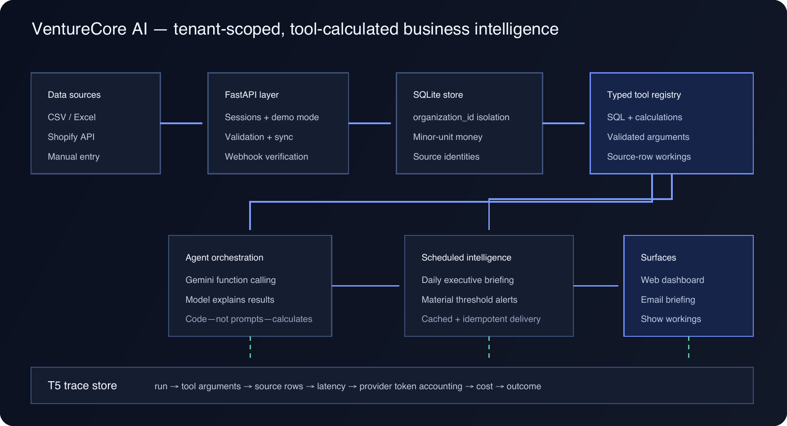

# VentureCore AI

VentureCore AI ingests small-business inventory, sales, and finance records, calculates traceable operating metrics, and delivers dashboards, agent explanations, and scheduled executive briefings. It is an intelligence layer over source systems—not a replacement ledger—and every displayed business figure is produced by deterministic code with source-row evidence.

## Architecture



The rendered diagram is committed at [`docs/architecture.png`](docs/architecture.png); its editable vector version is [`docs/architecture.svg`](docs/architecture.svg).

The implementation is a FastAPI application with a static HTML/CSS/JavaScript client and SQLite persistence. Gemini agents use provider function calling to invoke one typed registry in `backend/tools.py`; scheduled briefings use those tools directly and make no model call.

### Data flow: source to briefing

1. A user enters records manually, uploads CSV/Excel, or authorises Shopify.
2. FastAPI validates the request. Shopify backfills are resumable; webhooks are signature-checked and idempotent; reconciliation repairs missed events.
3. Records are upserted into tenant-scoped SQLite tables using `organization_id`, `source`, and `external_id`. Monetary values cross the database boundary as integer minor units plus an ISO currency.
4. A typed tool validates its arguments, filters every query by the caller's organisation, calculates the metric, and returns both the result and the identifiers of the source rows it used.
5. An on-demand agent may choose a tool and explain its result. The scheduled worker calls the same deterministic tool layer to build a cached executive briefing and material threshold alerts.
6. The dashboard and email format values for presentation. Headline dashboard figures expose **Show workings**, while T5 traces persist tool calls, latency, provider-reported token usage, configured cost, outcome, and failure mode.

### Architecture rules

| Rule | Why it exists |
|---|---|
| Every domain table and query is tenant-scoped | Adding tenancy after customers share a schema is a data-isolation rewrite. `organization_id` is therefore required even while the product has a simple account-to-organisation mapping. |
| Money is integer minor units plus currency | Floating-point storage silently changes financial values. Integer `_minor` columns preserve exact comparison and aggregation; formatting happens only at the UI or email boundary. |
| The database is a sync target | `source`, `external_id`, and `last_synced_at` allow CSV, Shopify, and manual records to coexist and be upserted without duplicates. |
| Business logic stays out of prompts | Models orchestrate and explain; ordinary typed functions own SQL, arithmetic, and thresholds so results can be tested exactly and traced to rows. |

## Product surface

The primary navigation contains **Inventory**, **Finance & Cash Flow**, and **Executive Briefing**. Research, company profile, Sales & CRM, Shopify sync, and file-quality checking remain available under **More**; they are demoted, not removed.

The root URL exposes a one-click, read-only fictional demo. Signed-in users can write operational data, connect Shopify, ask the existing agents questions, configure briefing delivery and quiet hours, and use the secondary research workflow.

## Correctness and eval harness

`tests/fixtures/business_metrics.json` is a deterministic dataset with hand-written expected answers and exact source identifiers. `tests/test_agent_evals.py` runs Inventory, Sales, and Finance agents with recorded provider function calls, then compares integer monetary outputs and operational metrics exactly—there is no numeric tolerance and no model network request.

The fixture covers revenue, gross margin by product, stock on hand, days of cover, overdue receivables, and expenses by category. The current recorded tool-selection evaluation passes all **6/6** representative questions, and all three numeric agent paths match the committed hand calculations; these results were reproduced by the verification command below on 2026-08-29. `NUMERIC_CORRECTNESS_AUDIT.md` records every user-visible numeric path that was audited and how model arithmetic was removed.

## Measured T5 trace results

The raw measurement is committed at [`docs/agent-run-measurements.json`](docs/agent-run-measurements.json). On 2026-08-29, thirty offline fixture agent runs—ten per operational agent—were executed on an arm64 development machine through the T5 trace store:

| Agent | Runs | Median trace latency | p95 trace latency | Recorded cost per run |
|---|---:|---:|---:|---:|
| Inventory Agent | 10 | 5 ms | 21 ms | 0 minor units |
| Sales & CRM Agent | 10 | 4 ms | 34 ms | 0 minor units |
| Finance & Cash Flow Agent | 10 | 5 ms | 6 ms | 0 minor units |
| Combined | 30 | 5 ms | 21 ms | 0 minor units |

These are measured offline orchestration and deterministic-tool latencies, not production Gemini latency. The recorded clients intentionally make no network request and expose no provider token accounting; the local pricing map was empty, so T5 correctly recorded zero cost. Production cost is populated only from provider-reported token usage and the operator's `GEMINI_COST_RATES_JSON`; this repository does not claim an unmeasured production cost.

## Local setup from a clean clone

Prerequisite: Python 3.11, matching `runtime.txt`.

```bash
git clone https://github.com/Qazi26-islam/VentureCore-AI.git
cd VentureCore-AI

python3.11 -m venv .venv
source .venv/bin/activate
python -m pip install --upgrade pip
python -m pip install -r requirements.txt -r requirements-dev.txt

cp .env.example .env
python -m uvicorn backend.main:app --reload
```

Open `http://127.0.0.1:8000` and choose **View demo workspace**. Startup applies migrations and idempotently seeds the fictional demo, so no manual database command is required. The placeholder `GEMINI_API_KEY` from `.env.example` is enough to run the deterministic demo; replace it with a real key only to call Gemini-backed agent and research endpoints. Before any shared deployment, replace `SESSION_SECRET` with a long random value.

### Optional integrations and delivery

- Shopify requires the public-app credentials and Fernet key documented in `.env.example`; the callback is `/integrations/shopify/callback` and the webhook is `/integrations/shopify/webhook`.
- Email briefings require the SMTP variables in `.env.example`.
- `.github/workflows/scheduled-workers.yml` invokes `/internal/jobs/run`. Set GitHub Actions secrets `VENTURECORE_WORKER_URL` and `VENTURECORE_WORKER_SECRET`, and use the same secret as Render's `JOB_RUNNER_SECRET`.

## Verification

```bash
python -m unittest discover -s tests -v
python -m ruff check backend tests
```

The normal test command includes migrations, tenant isolation, money boundaries, demo write protection, tool validation and rollback, numeric evals, trace access and retention, Shopify OAuth/sync/webhooks, briefing idempotency, and material-alert crossing tests. External API calls are mocked in tests.

## Known limitations

- SQLite and the in-process reconciliation thread suit the current single-instance deployment but are not a multi-worker queue or high-write database.
- Authentication uses application sessions and a simple account-to-default-organisation mapping; organisation membership and role management are not yet a complete multi-user administration system.
- The committed T5 benchmark is deliberately offline. Real Gemini and SMTP latency and cost depend on provider responses and deployment configuration and are not represented by that measurement.
- Shopify is the only live connector. File matching and Shopify identity reduce duplicates, but cross-source entity resolution is intentionally narrow.
- Scheduled delivery depends on an external cron request and the hosting process being reachable; a sleeping free-tier service can delay, though persistent idempotency state prevents the same period being processed twice.

## Demo script

The timed two-minute shot list and narration are in [`docs/DEMO_SCRIPT.md`](docs/DEMO_SCRIPT.md). It ends on the source-row **Show workings** trace.
